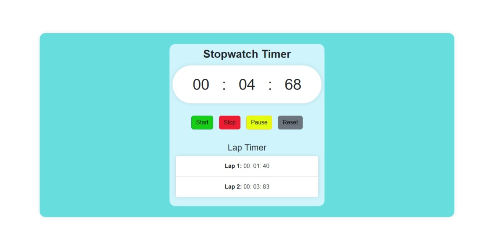

# Stopwatch Timer ⏱️⏱️⏱️

A sleek and functional Stopwatch Timer application built with HTML, CSS (Bootstrap), and JavaScript. This application allows users to track time, pause, reset, and record lap times efficiently.



## Features
- **Start Timer**: Start counting time.
- **Pause Timer**: Pause the ongoing timer.
- **Stop Timer**: Completely stop the timer.
- **Reset Timer**: Reset the timer back to `00:00:00`.
- **Lap Timer**: Record and display individual lap times.

## Technologies Used
- **HTML5**: For the structure of the application.
- **CSS (Bootstrap)**: For responsive styling and layout.
- **JavaScript**: For core stopwatch functionalities.

## Getting Started

### Prerequisites
- A modern web browser.

### Installation
1. Clone the repository:
   ```bash
   git clone https://github.com/muaz64/StopwatchTimer.git
   ```
2. Open the `index.html` file in your browser.

## Usage
1. Click the **Start** button to begin the timer.
2. Use the **Pause** button to pause the timer.
3. Click **Stop** to stop and reset the timer.
4. Use the **Lap** button to record lap times.
5. Click **Reset** to clear all lap times and reset the timer.


## Contributing
Contributions are welcome! Feel free to fork the repository, submit a pull request, or open an issue.

## License
This project is licensed under the MIT License.

---

Check out the live project or view the source code: [GitHub Repository](https://github.com/muaz64/StopwatchTimer.git)


---